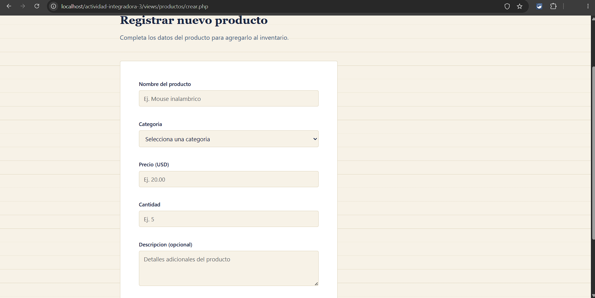
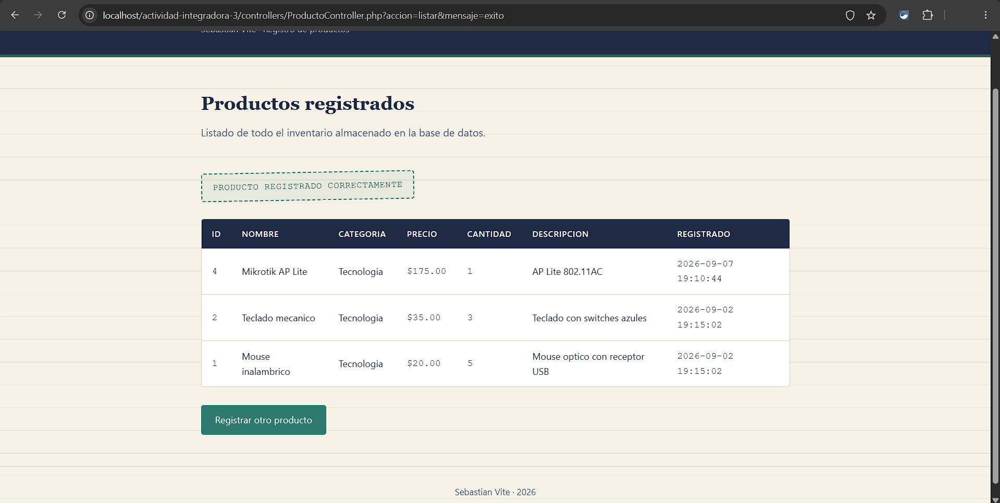

# Sistema de Inventario — Sebastian Vite

**Estudiante:** Sebastian Andrés Vite Díaz
**Carrera:** Ingeniería en Sistemas

## Descripción

Aplicación web para el registro y consulta de productos de un inventario básico,
desarrollada con HTML, CSS, JavaScript, PHP y MySQL, aplicando el patrón de
diseño MVC (Modelo - Vista - Controlador).

## Flujo de la aplicación

```
Vista (formulario) → Controlador → Modelo → Base de datos MySQL
```

## Estructura del proyecto

```
actividad-integradora-3/
├── index.php
├── integradora.sql
├── config/
│   └── conexion.php
├── controllers/
│   └── ProductoController.php
├── models/
│   └── Producto.php
├── views/
│   └── productos/
│       ├── crear.php
│       └── listar.php
├── css/
│   └── estilos.css
└── js/
    └── script.js
```

## Funcionalidades

- **Registrar producto**: formulario con nombre, categoría, precio, cantidad y
  descripción.
- **Validación en JavaScript**: campos vacíos, valores numéricos (precio y
  cantidad), longitud mínima del nombre, y valores incorrectos (precio o
  cantidad negativos).
- **Validación en el servidor (PHP)**: además de la validación en el navegador,
  el controlador vuelve a validar los datos antes de insertarlos.
- **Consulta de inventario**: los productos registrados se muestran en una tabla
  HTML, ordenados del más reciente al más antiguo.

## Tecnologías utilizadas

- HTML5 semántico
- CSS3 (Flexbox, variables en :root, diseño responsivo)
- JavaScript (validaciones, manipulación del DOM)
- PHP 8 (estructura MVC, mysqli con consultas preparadas)
- MySQL / MariaDB
- Git y GitHub

## Cómo ejecutar el proyecto localmente

1. Instalar un entorno local con PHP y MySQL (por ejemplo, **XAMPP**).
2. Copiar la carpeta `actividad-integradora-3` dentro de `htdocs` (en XAMPP).
3. Abrir **phpMyAdmin** y ejecutar el archivo `integradora.sql` para crear la base
   de datos y la tabla `productos` (incluye un par de productos de ejemplo).
4. Verificar que los datos de conexión en `config/conexion.php` coincidan con
   tu instalación local (por defecto: usuario `root`, sin contraseña).
5. Iniciar Apache y MySQL desde el panel de XAMPP.
6. Abrir en el navegador: `http://localhost/actividad-integradora-3/`.

## Captura de pantalla



